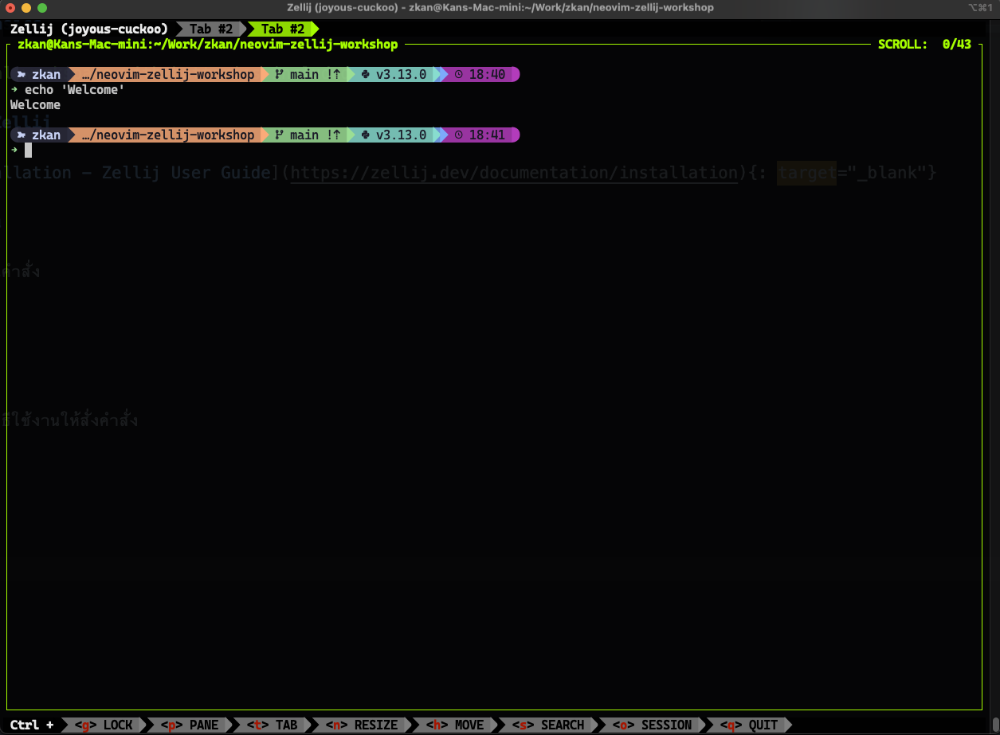

# Zellij Basics

> A terminal workspace with batteries included

## วิธีติดตั้ง Zellij

ดูได้ที่ [Installation - Zellij User
Guide](https://zellij.dev/documentation/installation){: target="_blank"}

## การใช้งาน

ง่ายมาก แค่รันคำสั่ง

```bash
zellij
```

หรือถ้าอยากดูวิธีใช้งานให้สั่งคำสั่ง

```bash
zellij -h
```

เราจะเข้ามาที่หน้าจอแบบนี้



ซึ่งเป็น default configuration ของ Zellij ถ้าเราอยากปรับหน้าตา
default ให้เข้าไปอ่านส่วน [Layouts - Zellij User
Guide](https://zellij.dev/documentation/layouts){: target="_blank"}

## Pane & Tab

### การสร้าง Pane หรือ Tab ใหม่

* เราจะใช้คำสั่ง `Ctrl+p` แล้วกด `n` เพื่อสร้าง pane ใหม่ แบบ vertical
* เราจะใช้คำสั่ง `Ctrl+p` แล้วกด `d` เพื่อสร้าง pane ใหม่ แบบ horizontal
* เราจะใช้คำสั่ง `Ctrl+t` แล้วกด `n` เพื่อสร้าง tab ใหม่

### การ Navigate ระหว่าง Pane

* กด `Ctrl+p` แล้วกด `h`, `j`, `l`, `k` หรือจะใช้ arrow keys ก็ได้
* กด `Alt` ค้าง แล้วตามด้วย `h`, `j`, `l`, `k` หรือ arrow keys

### การ Navigate ระหว่าง Tab

* กด `Ctrl+t` แล้วกดเลขตามตำแหน่งของ tab นั้น ๆ
* กด `Alt` ค้าง แล้วตามด้วย `h`, `j`, `l`, `k` หรือ arrow keys (ถ้าใน tab นั้น ๆ มีหลาย
panes ก็จะไล่ไปตาม pane ก่อน แล้วค่อยย้าย tab)

## การ Detach

กด `Ctrl+o` แล้วกด `d`

## การสั่งงาน Zellij ผ่าน CLI

อ่านรายละเอียดได้ที่ [Controlling Zellij through the CLI - Zellij User
Guide](https://zellij.dev/documentation/controlling-zellij-through-cli){: target="_blank"}
ซึ่งเดี๋ยวเราจะใช้ในหัวข้อ [Neovim and Zellij Together](./neovim-and-zellij-together.md)
